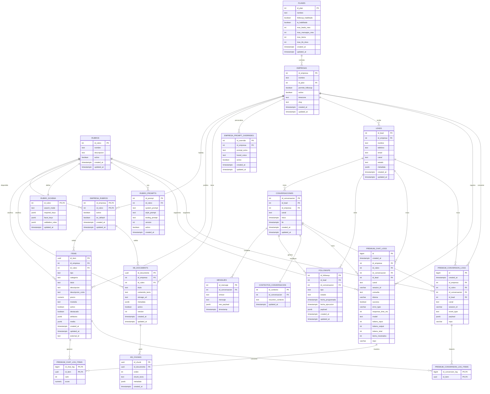

# Diagrama ER – Base de Datos Agente Comercial Inteligente Multirubro

```mermaid
erDiagram
  RUBROS {
    int id_rubro PK
    text nombre
    text descripcion
    boolean activo
    timestamptz created_at
    timestamptz updated_at
  }

  PLANES {
    int id_plan PK
    text nombre
    boolean followup_habilitado
    boolean ia_habilitada
    int max_leads_mes
    int max_mensajes_mes
    int max_items
    int max_kb_docs
    timestamptz created_at
    timestamptz updated_at
  }

  EMPRESAS {
    int id_empresa PK
    text nombre
    int id_plan FK
    boolean permite_followup
    boolean activa
    text timezone
    text slug
    timestamptz created_at
    timestamptz updated_at
  }

  EMPRESA_RUBROS {
    int id_empresa PK,FK
    int id_rubro PK,FK
    boolean activo
    boolean es_default
    timestamptz created_at
    timestamptz updated_at
    
  }

  ITEMS {
    uuid id_item PK
    int id_empresa FK
    int id_rubro FK
    text tipo
    text categoria
    text titulo
    text descripcion
    text descripcion_corta
    numeric precio
    text moneda
    boolean activo
    boolean destacado
    jsonb atributos
    jsonb media
    timestamptz created_at
    timestamptz updated_at
    text external_id 
  }

  KB_DOCUMENTS {
    uuid id_documento PK
    int id_empresa FK
    int id_rubro FK
    text titulo
    text contenido_texto
    text storage_url
    jsonb metadata
    boolean activo
    int version
    timestamptz created_at
    timestamptz updated_at
  }

  KB_CHUNKS {
    uuid id_chunk PK
    uuid id_documento FK
    int orden
    text chunk_texto
    jsonb metadata
    timestamptz created_at
  }

  RUBRO_SCHEMA {
    int id_rubro PK,FK
    text search_mode
    jsonb required_keys
    jsonb facet_keys
    jsonb validation_rules
    timestamptz updated_at
  }

  RUBRO_PROMPTS {
    int id_prompt PK
    int id_rubro FK
    text system_prompt
    text style_prompt
    text tooling_prompt
    int version
    boolean activo
    timestamptz created_at
  }

  EMPRESA_PROMPT_OVERRIDES {
    int id_override PK
    int id_empresa FK
    text prompt_extra
    text brand_voice
    boolean activo
    timestamptz created_at
    timestamptz updated_at
    
  }

  LEADS {
    int id_lead PK
    int id_empresa FK
    text nombre
    text telefono
    text email
    text canal
    text estado
    jsonb metadata
    timestamptz created_at
    timestamptz updated_at
  }

  CONVERSACIONES {
    int id_conversacion PK
    int id_lead FK
    int id_empresa FK
    text canal
    timestamptz inicio
    timestamptz fin
    timestamptz created_at
    timestamptz updated_at
  }

  MENSAJES {
    int id_mensaje PK
    int id_conversacion FK
    text emisor
    text mensaje
    jsonb raw_payload
    timestamptz timestamp
  }

  FOLLOWUPS {
    int id_followup PK
    int id_lead FK
    int id_conversacion FK
    text tipo
    text estado
    timestamptz fecha_programada
    timestamptz fecha_ejecucion
    jsonb payload
    timestamptz created_at
    timestamptz updated_at
  }

  CONTEXTOS_CONVERSACION {
    int id_contexto PK
    int id_conversacion FK  
    text resumen_contexto
    timestamptz updated_at
  }

  %% ------------------------------
  %% Analítica Premium (sin migrar PRO)
  %% ------------------------------
  PREMIUM_CHAT_LOGS {
    bigint id PK
    timestamptz created_at
    int id_empresa FK
    int id_rubro FK
    int id_conversacion FK
    int id_lead FK
    text canal
    varchar session_id
    text consulta
    varchar idioma
    boolean success
    varchar error_type
    int response_time_ms
    text model
    int tokens_input
    int tokens_output
    int tokens_total
    int items_mostrados
    varchar repo
  }

  PREMIUM_CHAT_LOG_ITEMS {
    bigint id_chat_log PK,FK
    uuid id_item PK,FK
    int rank
    numeric score
  }

  PREMIUM_CONVERSION_LOGS {
    bigint id PK
    timestamptz created_at
    int id_empresa FK
    int id_rubro FK
    int id_conversacion FK
    int id_lead FK
    text canal
    varchar session_id
    text event_type  
    jsonb payload
    varchar repo
  }

  PREMIUM_CONVERSION_LOG_ITEMS {
    bigint id_conversion_log PK,FK
    uuid id_item PK,FK
  }

  %% -------------------------
  %% Relaciones principales
  %% -------------------------
  PLANES ||--o{ EMPRESAS : contrata

  EMPRESAS ||--o{ EMPRESA_RUBROS : habilita
  RUBROS   ||--o{ EMPRESA_RUBROS : disponible

  EMPRESAS ||--o{ ITEMS : publica
  RUBROS   ||--o{ ITEMS : clasifica
  EMPRESA_RUBROS ||--o{ ITEMS : valida

  EMPRESAS ||--o{ KB_DOCUMENTS : tiene
  RUBROS   ||--o{ KB_DOCUMENTS : clasifica
  EMPRESA_RUBROS ||--o{ KB_DOCUMENTS : valida
  KB_DOCUMENTS ||--o{ KB_CHUNKS : parte

  RUBROS ||--|| RUBRO_SCHEMA : define
  RUBROS ||--o{ RUBRO_PROMPTS : usa
  EMPRESAS ||--o{ EMPRESA_PROMPT_OVERRIDES : personaliza

  EMPRESAS ||--o{ LEADS : recibe
  LEADS ||--o{ CONVERSACIONES : inicia
  CONVERSACIONES ||--o{ MENSAJES : contiene
  LEADS ||--o{ FOLLOWUPS : tiene
  CONVERSACIONES ||--o{ FOLLOWUPS : genera
  CONVERSACIONES ||--|| CONTEXTOS_CONVERSACION : mantiene

  %% -------------------------
  %% Relaciones analítica Premium
  %% -------------------------
  EMPRESAS ||--o{ PREMIUM_CHAT_LOGS : registra
  RUBROS   ||--o{ PREMIUM_CHAT_LOGS : segmenta
  CONVERSACIONES ||--o{ PREMIUM_CHAT_LOGS : traza
  LEADS ||--o{ PREMIUM_CHAT_LOGS : traza

  PREMIUM_CHAT_LOGS ||--o{ PREMIUM_CHAT_LOG_ITEMS : muestra
  ITEMS ||--o{ PREMIUM_CHAT_LOG_ITEMS : aparece

  EMPRESAS ||--o{ PREMIUM_CONVERSION_LOGS : convierte
  RUBROS   ||--o{ PREMIUM_CONVERSION_LOGS : segmenta
  CONVERSACIONES ||--o{ PREMIUM_CONVERSION_LOGS : traza
  LEADS ||--o{ PREMIUM_CONVERSION_LOGS : traza

  PREMIUM_CONVERSION_LOGS ||--o{ PREMIUM_CONVERSION_LOG_ITEMS : impacta
  ITEMS ||--o{ PREMIUM_CONVERSION_LOG_ITEMS : convierte
        
```
