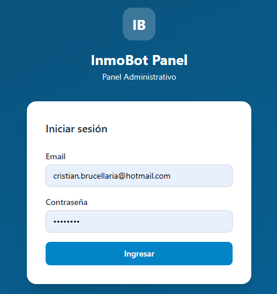
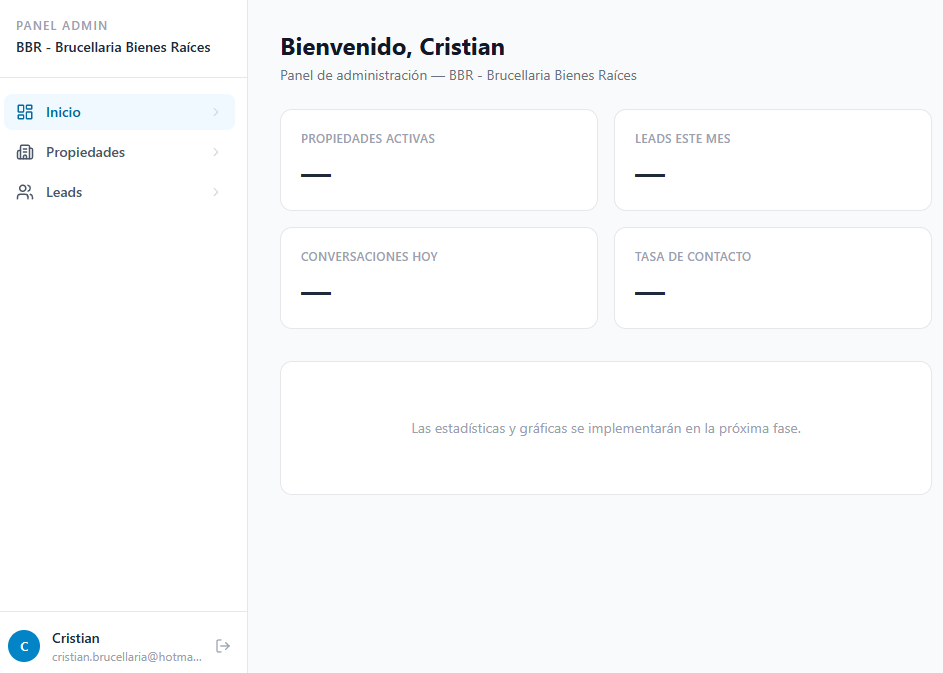
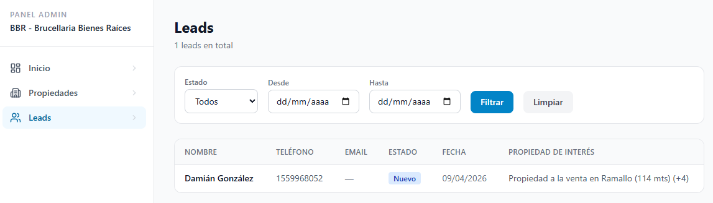
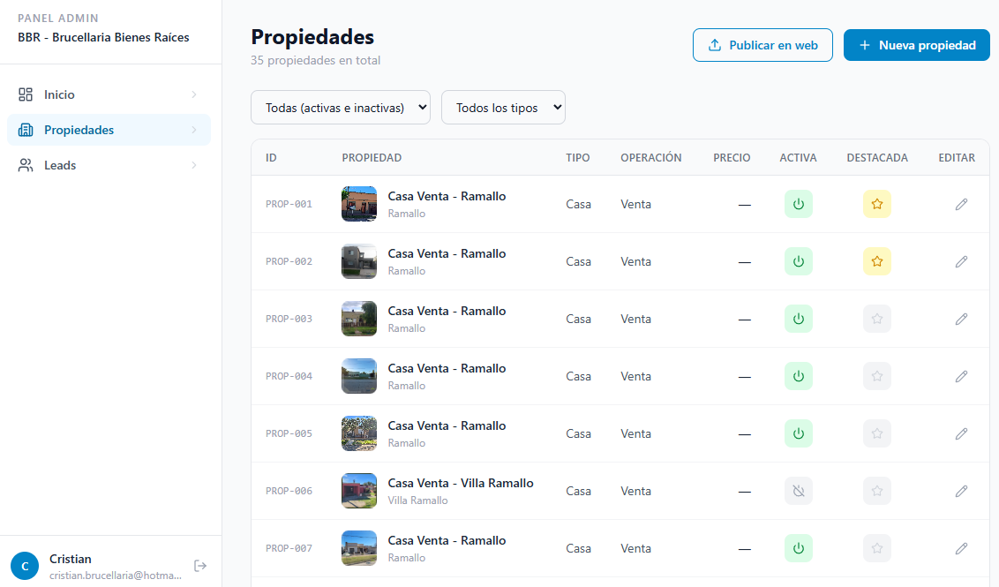
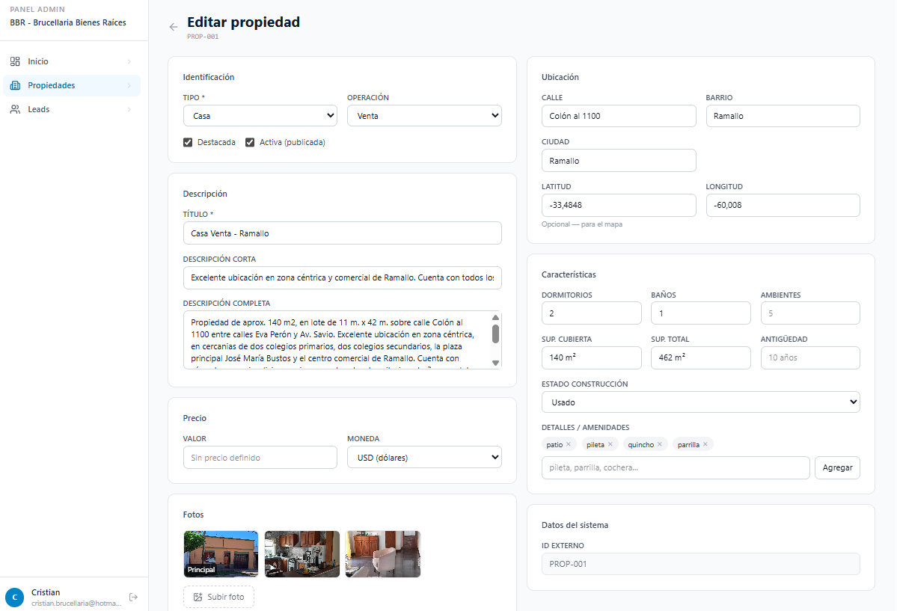
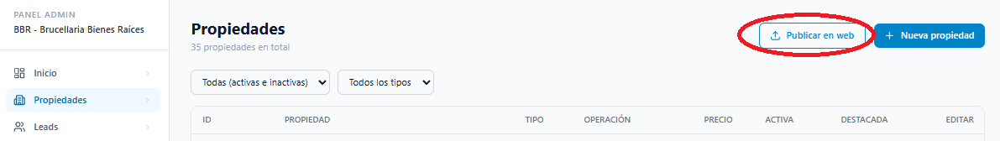
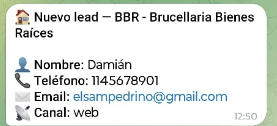
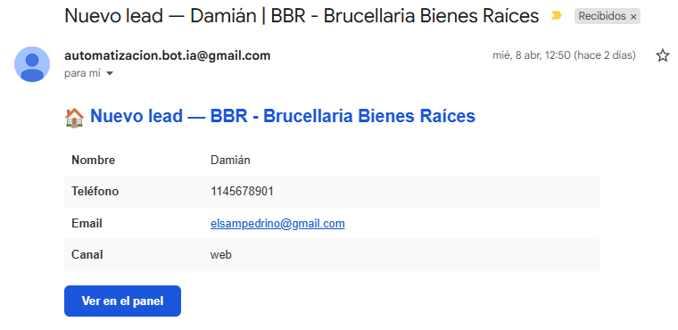

# Guía de uso — Panel de Administración InmoBot
### BBR - Brucellaria Bienes Raíces

---

## 1. Introducción

El Panel de Administración es tu herramienta central para gestionar todo lo que pasa con el asistente virtual de BBR.

Desde acá podés:
- Ver y gestionar los contactos (leads) que llegaron a través del bot
- Administrar el catálogo de propiedades
- Publicar cambios directamente en tu página web

No necesitás saber nada de tecnología para usarlo. Todo está pensado para que sea simple y rápido.

---

## 2. Acceso al sistema

Ingresá desde cualquier navegador a:

**https://panel.automatizacionia.com.ar/login** o desde el botón "Acceso Clientes" de la pagina **https://www.automatizacionia.com.ar/**

Tus credenciales de acceso:
- **Email:** cristian.brucellaria@hotmail.com
- **Contraseña:** BBR2026*

Una vez que ingresás, el sistema te va a recordar la sesión. No es necesario que inicies sesión cada vez que entrás.

> Si en algún momento te pide volver a ingresar, simplemente cargá de nuevo tus datos.

---

## 3. Pantalla principal

Al ingresar vas a ver el Dashboard, que es la pantalla de inicio con un resumen general.

En el menú de la izquierda encontrás las tres secciones principales:

- **Inicio** — Resumen general
- **Leads** — Los contactos que llegaron por el bot
- **Propiedades** — Tu catálogo de propiedades

---

## 4. Gestión de leads

Esta es la parte más importante del sistema. Cada vez que alguien deja sus datos a través del asistente virtual, ese contacto aparece acá como un "lead".

### Ver el listado de leads

Hacé clic en **Leads** en el menú lateral.

Vas a ver una tabla con todos los contactos: nombre, teléfono, email, canal de contacto, estado y fecha.

### Filtrar leads

Podés buscar por nombre, filtrar por estado (Nuevo, Contactado, Cerrado) o por fecha. Esto es útil cuando tenés muchos contactos y querés ordenarlos.

### Ver el detalle de un lead

Hacé clic en cualquier fila para ver el detalle completo del contacto.

[Insertar imagen: detalle de un lead]

En el detalle vas a ver:
- Los datos del contacto (nombre, teléfono, email)
- Las propiedades que le interesaron durante la conversación
- El historial de la conversación con el bot

### Cambiar el estado de un lead

En el detalle del lead, podés cambiar su estado según en qué etapa está:

| Estado | Cuándo usarlo |
|--------|--------------|
| **Nuevo** | Recién llegó, todavía no lo contactaste |
| **Contactado** | Ya lo llamaste o le escribiste |
| **Cerrado** | Se cerró el negocio o descartaste el contacto |

Esto te ayuda a tener todo organizado y saber qué contactos tenés pendientes.

---

## 5. Gestión de propiedades

Desde acá administrás todo el catálogo de propiedades que el bot conoce y muestra a los interesados y que ademas son parte de tu pagina Web.

### Ver el listado de propiedades

Hacé clic en **Propiedades** en el menú lateral.

Cada propiedad muestra:
- Foto principal y título
- Tipo y operación (venta / alquiler)
- Precio
- Estado: activa o inactiva
- Si está destacada o no

### Activar / desactivar una propiedad

Con el ícono de encendido (columna "Activo") podés activar o desactivar una propiedad con un solo clic. Las propiedades inactivas no aparecen en la web ni el bot las menciona.

> Usá esto cuando una propiedad se vende o alquila: simplemente la desactivás y listo.

### Destacar una propiedad

Con el ícono de estrella (columna "Destacado") marcás una propiedad como destacada. El bot la va a priorizar cuando recomiende opciones a los interesados y demas va a aprecer en la seccion "Destacados" de tu pagina Web.

### Editar una propiedad

Hacé clic en el ícono de lápiz para editar los datos de una propiedad existente.

Podés modificar:
- Título, descripción, tipo y operación
- Precio y moneda
- Ubicación (ciudad, barrio, dirección)
- Características (superficie, ambientes, baños, etc.)
- Fotos

### Agregar una propiedad nueva

Hacé clic en el botón **+ Nueva propiedad** (arriba a la derecha del listado).

Completá el formulario con los datos de la propiedad y subí las fotos. El sistema le asigna automáticamente un código interno (ej: PROP-036).

---

## 6. Publicación en la web

Cuando hacés cambios en las propiedades (activar, desactivar, editar o agregar), esos cambios **se guardan en el sistema pero todavía no aparecen en tu página web**.

Para publicar los cambios en la web, tenés que hacer un paso adicional:

1. Entrá al listado de propiedades
2. Hacé clic en el botón **Publicar en Web** (arriba a la derecha)

3. Confirmá la acción

El sistema va a actualizar automáticamente tu página web en unos segundos. No necesitás hacer nada más.

> **Recordá:** siempre que hagas cambios importantes en el catálogo, publicá para que tu web quede actualizada.

---

## 7. Notificaciones

Cada vez que el bot capta un nuevo lead, vas a recibir una notificación de dos formas:

### Por Telegram

Te llega un mensaje con los datos del contacto: nombre, teléfono, email y las propiedades que le interesaron.

### Por Email

Te llega un correo con el mismo detalle y un botón para ir directo al panel y ver la ficha completa del lead.

> Las notificaciones llegan a los pocos segundos de que el contacto deja sus datos. Así podés llamarlo mientras todavía está interesado.

---

## 8. Tips finales

- **Revisá los leads todos los días.** La velocidad de respuesta es clave: cuanto antes contactes a alguien, más chances tenés de cerrar.

- **Mantené el catálogo actualizado.** Si una propiedad se vendió, desactivala enseguida para que el bot no la siga ofreciendo.

- **Usá "Destacado" estratégicamente.** Las propiedades destacadas son las que el bot muestra primero. Poné ahí las que más querés vender o alquilar.

- **Publicá después de cada cambio importante.** Un clic y tu web queda actualizada.

- **El bot trabaja 24/7.** Aunque vos no estés disponible, el asistente está atendiendo y captando contactos. Revisá las notificaciones cuando puedas.

---

*¿Dudas o problemas? Contactate con el equipo de soporte de InmoBot.*